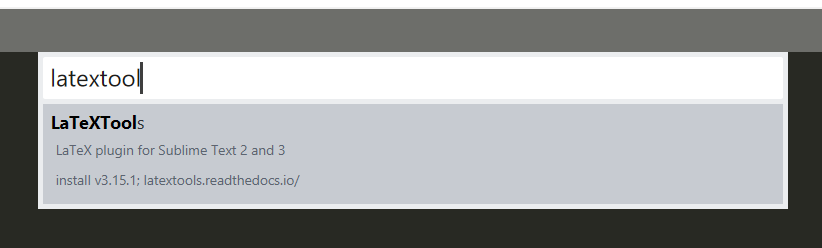
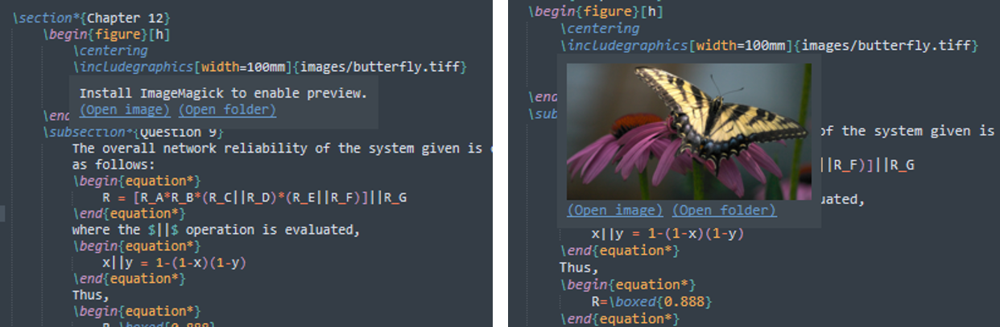

# LaTeX-in-Sublime-Text-3
A visual guide for making LaTeX editor in Sublime.

by David Nnaji

# Background
LaTeX is a beautiful tool for academic writing and there are many editing environments built on the Tex platform that are freely available. My favorite editor is Overleaf but there are features that the platform offers that are blocked by a pay-wall. This is a visual guide for setting up a similar LaTeX editing environment in Sublime Text 3 (ST3) using open-source packages for Windows 10. Build instructions for Mac OS and Linux devices are provided in the official documentation for LaTeXTools.


## Notable Features
Here are some notable features in the base build for Windows:

- Quick and lightweight document preview
- Reverse search
- Forward search
- In-line image preview
- All your favorite Sublime editing features!

A full list of features offered by LaTeXTools can be found [here](https://latextools.readthedocs.io/en/latest/features/). More capabilities can be added as desired by installing additional packages created by the community. Examples are provided in the 'Additional Resources' section along with descriptions of my own personal favorites.

## Minimum Requirements
- Windows 10 (x64)
- Sublime Text 3
- A Tex distribution (i.e. MiKTeX or TexLive)
- Sumatra PDF

# Installation

## 1. Install the Required Software
### Sublime Text 3 (x64)
**[Sublime Text](https://www.sublimetext.com/)** is a cross-platform source code editor that support many programming languages and markup languages including LaTeX. The latest version is ST3.

### MikTeX or TexLive
Both **[MiKTeX](https://miktex.org/download)** and **[TexLive](https://tug.org/texlive/)** will work with the LaTeXTools package on Windows. TexLive will take longer to initially install but has all the required Tex packages to get running. MiKTeX appears to be more popular and has a shorter initial installation. However, a couple missing packages will need to be downloaded on the first build. Pick one and follow the relevant documentation.

### Sumatra 
The **[Sumatra PDF Viewer](https://www.sumatrapdfreader.org/free-pdf-reader.html)** is recommended by the developers of LaTeXTools. Its very lightweight and supports both forward and inverse search. It is also the only viewer supported on Windows that is compatible with LaTeXTools.


## Update system PATH Variable
The system `PATH` variable can be modified in the Command Prompt or through System Properties window in the Control Panel. The simplest way is to get the location of any program search for the program in the Windows search bar, open the file location, and open the file properties. Copy the address in the target field and remove the part of the address that references the `.exe` file. Regardless of the method, ensure the executable file for the following programs are included in your system `PATH`.


1. Sublime Text
2. Your selected Tex distribution (MiKTeX or TexLive)
3. SumatraPDF

Follow the same procedure if you plan on installing [Ghostscript](###Ghostscript) or ImageMagick.

## 2. Install Package Control and the LaTexTools Package
The easiest way to install the LaTeXTool package is with [Package Control](https://packagecontrol.io/installation). Package Control makes it easy to install and remove ST3 packages. Once installed, 

1. Open the command palette again, type `Package Control: Install Package`, and press `enter`
2. Type `LateXTools`, and press `enter`



## 3. Configure LaTeXTools Settings
To open the LaTeXTools User settings in Sublime navigate to `Preferences > Package Settings > LaTeXTools > Settings-User`. Make the following adjustments depending on your Tex distribution and preferences. It's advisable to adjust anything else only after your first successful build. The user settings file is well commented so you shouldn't have too much trouble figuring out what you want.

### Preview settings
Optional: `"preview_math_mode": "none",`
Optional: `"preview_image_mode": "hover",`

### Platform settings
Adapt these settings as needed for your machine
```
"windows": {
	// Path used when invoking tex & friends; "" is fine for MiKTeX
	// For TeXlive 2011 (or other years) use
	"texpath" : "*PATH TO TEX LIVE IF USED*;$PATH",
	// TeX distro: "miktex" or "texlive"
	"distro" : "*miktex or texlive*",
	// Command to invoke Sumatra. If blank, "SumatraPDF.exe" is used (it has to be on your PATH)
	"sumatra": "*SUMATRA PATH HERE*",
	// Command to invoke Sublime Text. Used if the keep_focus toggle is true.
	// If blank, "subl.exe" or "sublime_text.exe" will be used.
	"sublime_executable": "*SUBLIME EXECUTABLE LOCATION HERE*",
	// how long (in seconds) to wait after the jump_to_pdf command completes
	// before switching focus back to Sublime Text. This may need to be
	// adjusted depending on your machine and configuration.
	"keep_focus_delay": 0.5
},
```

### Build engine settings
Optional: `"display_log" : true,`

### Viewer settings
`"viewer": "sumatra",`
`"open_pdf_on_build": true,`

## 4. Link Sumatra to ST3
One of the great features of LaTeXTools is inverse search. This is the ability to double-click anywhere in the PDF preview and automatically be guided to the corresponding line in the editor. To set up inverse search, run the following command in the Command Prompt.

`sumatrapdf.exe -inverse-search "\"C:\Program Files\Sublime Text 3\sublime_text.exe\" \"%f:%l\""`

Be sure to replace the path in the example with the actual location of the sublime text executable file.

## 5. Test Your Build
- Change the build system to Latex `Tools > Build System > LaTeX`
- Download the example Latex files or create your own
- Click `Tools > Build` or `Ctrl+B` to build.
- Turn on Spell Check: `View > Spell Check` or `F6`.

### Errors
#### Missing Packages Build Error
To address this error simply proceed with the installation of the missing packages. Do not cancel them.

## 5. Install Optional Software
### Ghostscript
**[Ghostscript](https://ghostscript.com/download/gsdnld.html)** allows equation previewing in the Sublime editor. If you downloaded MiKTeX or TexLive Ghostscript will already be installed. If you are experiencing troubles confirm that your system `PATH` includes references to the Tex distribution you selected (MiKTeX or TexLive). If you are still lacking math preview functionality, install the Ghostscript general public release.

### ImageMagick
**[ImageMagick](https://imagemagick.org/script/download.php#windows)** augments the image preview capabilities that come with LaTeXTools (i.e. anything other than PNGs, JPEGs, GIFs, PDFs, EPSs, and PSs). During installation, ensure that only 'Add application directory to system path' is selected when prompted. Once ImageMagick is installed, ensure the executable directory location is added to your system `PATH` variable. Restart ST3 and hover over any `\includegraphics{}` commands. If graphics are still not displayed check that **FIX design ->** `;PATH` is appended at the end of `"texpath"` in the LaTeXTools Windows platform settings.



## Install Additional Sublime Packages
### LaTeXTab
### Github Workflow

# Bonus Tips and Tricks
## Pandas Dataframe to LaTeX Table
https://pandas.pydata.org/pandas-docs/stable/reference/api/pandas.DataFrame.to_latex.html

# References 
[1] LaTeX Project Official Website. https://www.latex-project.org/

[2] LaTeXTools Documentation. Available: https://latextools.readthedocs.io/en/latest/ 

[3] LaTeXTools Package Page. Available: https://packagecontrol.io/packages/LaTeXTools

[4] Setup for LaTeX and Sublime Text 3 by Daniel Herber. Available: https://www.danielherber.com/guides.php?option=latex-st3
